# 2526_ESE_TP_FPGA_AFIF_AITALLA

##  Objectif du TP

L’objectif de ce premier TP est de :

- Créer un projet Quartus dédié au FPGA Cyclone V de la carte **DE10-Nano**.
- Écrire un premier fichier VHDL simple.
- Associer les signaux VHDL aux broches physiques (pins) du FPGA via le **Pin Planner**.
- Compiler le projet.
- Programmer physiquement la carte via l’interface **USB-Blaster II**.
- Comprendre la structure du FPGA détectée (SOC vs FPGA).

---

##  1. Création du Projet Quartus

Un projet Quartus est un espace de travail contenant :
- Les fichiers VHDL
- Le fichier de contraintes (pins)
- Les options de compilation
- Les fichiers de programmation (.sof)

Dans **File → New Project Wizard**, on définit :
1. Le dossier du projet  
2. Le nom du projet et du top-level entity  
3. Le FPGA cible :  
   **5CSEBA6U23I7** (Cyclone V SoC)

Voici un aperçu du projet dans Quartus :

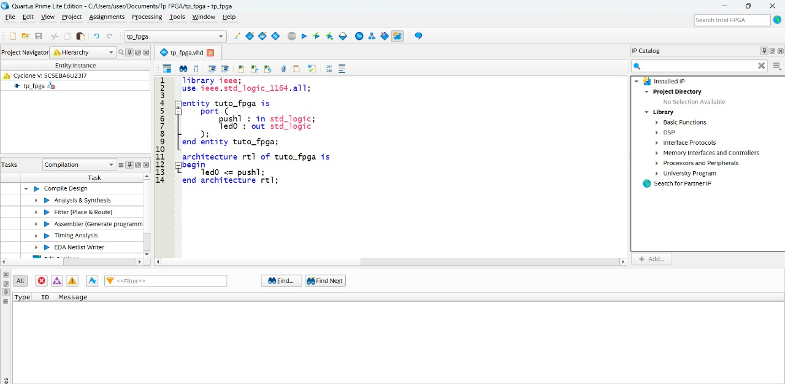

---

##  2. Premier fichier VHDL

Créons un composant minimal où une LED reflète l’état du bouton `pushl`.

```vhdl
library ieee;
use ieee.std_logic_1164.all;

entity tuto_fpga is
    port (
        pushl : in  std_logic;
        led0  : out std_logic
    );
end entity tuto_fpga;

architecture rtl of tuto_fpga is
begin
    led0 <= pushl;
end architecture rtl;
---
```
## Fichier de Contraintes (Pin Planner)

Cette étape consiste à associer les signaux définis dans le fichier VHDL aux broches physiques du FPGA.  
Le rôle du fichier de contraintes est essentiel : sans lui, Quartus ne peut pas relier les signaux logiques du code aux composants de la carte (LEDs, boutons, etc.).

Dans ce TP, nous assignons :
- la LED utilisateur (`led0`)
- le bouton poussoir de l’encodeur (`pushl`)

L’image ci-dessous montre la fenêtre du **Pin Planner** après affectation des deux broches : elle confirme que chaque signal VHDL est correctement relié à sa broche physique sur le Cyclone V.

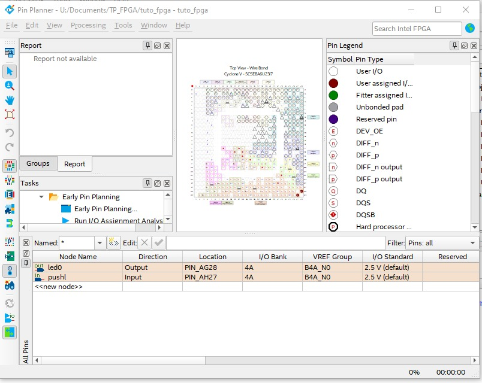)
---

##  Programmation de la Carte (Programmer)

Une fois la compilation terminée, le fichier `.sof` doit être envoyé dans la partie FPGA du composant Cyclone V.  
La programmation se fait via l’interface **USB-Blaster II**, en mode **JTAG**, qui permet de charger la configuration directement dans le FPGA.

Lors de la détection automatique, Quartus identifie deux composants :
- `SOCVHPS` : processeur ARM (non programmable pour ce TP)
- `5CSEBA6U23` : le FPGA, que nous devons configurer

L’image ci-dessous montre cette détection ainsi que la sélection du fichier `.sof` et la case *Program/Configure* activée avant l'envoi dans la carte.
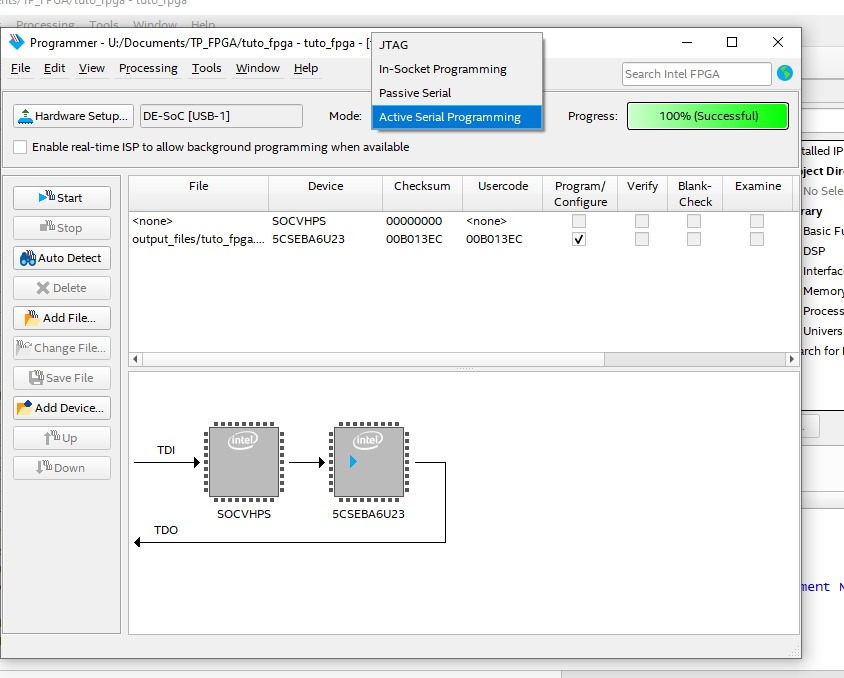)

Une fois la programmation lancée, une barre verte indique que la configuration a été chargée avec succès dans le FPGA.

---
---

# Partie 2 — Blinking LED (Horloge, Reset, RTL Viewer)

##  Choix de l’horloge du FPGA

Plusieurs horloges sont disponibles sur la carte DE10-Nano.  
Dans ce TP, nous utilisons :

- **Signal** : FPGA_CLK1_50  
- **Fréquence** : 50 MHz  
- **Broche FPGA** : **PIN_V11**

Cette information est fournie dans le User Manual de la carte DE10-Nano.


Cette horloge est utilisée comme source temporelle pour le clignotement de la LED.

---

##  Blink simple (sans compteur)

Le premier design séquentiel implémente un flip-flop qui inverse son état à chaque front montant de l’horloge.  
Dans le RTL Viewer de Quartus, ce comportement se traduit par :

- un registre `r_led`  
- un multiplexeur de reset  
- une porte NOT en retour  
- la sortie `o_led` reliée au registre


Voici ensuite le schéma fonctionnel que nous avons dessiné pour illustrer ce comportement :

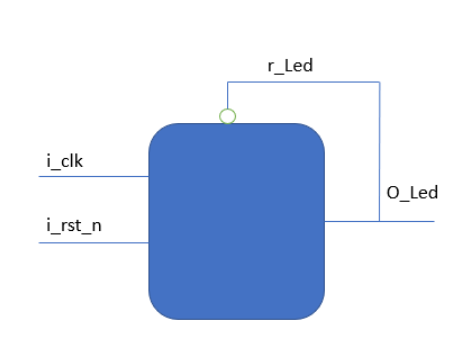

Ce schéma confirme que le VHDL a bien été synthétisé en un circuit séquentiel minimal.

---

## Blink avec diviseur de fréquence (compteur)

Le clignotement à 50 MHz est invisible à l’œil humain.  
Pour obtenir un clignotement perceptible, un **diviseur de fréquence** a été ajouté.

Un compteur incrémente à chaque cycle d’horloge et, lorsqu’il atteint une valeur maximale, il :

1. se réinitialise,  
2. inverse l’état de `r_led`.

Voici le schéma RTL généré automatiquement par Quartus :  

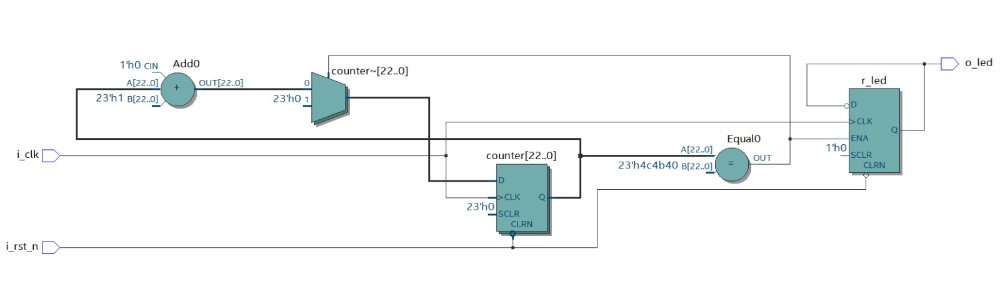

Et voici notre schéma fonctionnel simplifié du design :

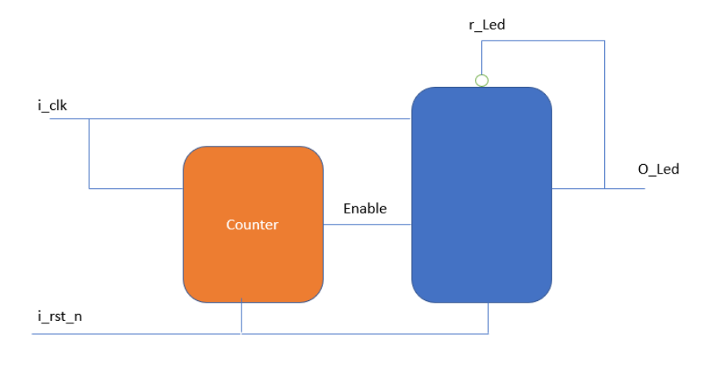

Cette représentation valide que le design VHDL a été correctement traduit en une architecture matérielle séquentielle.

---

##  Importance du signal de reset

Un signal de reset est indispensable pour garantir un état initial connu du circuit.  
Il assure :

- une mise à zéro du compteur,  
- une valeur déterministe pour `r_led` au démarrage,  
- un comportement stable et reproductible.

Sans reset, les registres démarreraient dans un état indéfini.

---

##  Bouton utilisé pour le reset

Le reset est associé au bouton poussoir :

- **Bouton** : KEY0  
- **Broche FPGA** : **PIN_AH17**

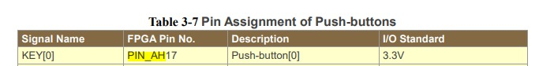

Ce bouton permet de relancer le compteur et la LED à tout moment.

---

## Signification du suffixe `_n` dans `i_rst_n`

Le suffixe **`_n`** indique que le signal est **actif à l’état bas**.

Ainsi :

- `i_rst_n = '0'` → le circuit est réinitialisé  
- `i_rst_n = '1'` → fonctionnement normal  

Cette convention est courante en électronique numérique, car les boutons poussoirs et nombreux circuits logiques produisent un niveau bas lorsqu’ils sont activés.

---

# Écran magique

## Introduction

L’objectif de ce projet est la réalisation d’un **écran magique numérique** implémenté sur **FPGA**, en s’inspirant du fonctionnement du télécran.  
L’affichage est assuré via la **sortie HDMI** de la carte **DE10-Nano**, tandis que le déplacement du curseur est contrôlé à l’aide des **deux encodeurs rotatifs** présents sur la carte mezzanine.

Le projet a été développé de manière progressive selon les étapes suivantes :

- Gestion des encodeurs rotatifs  
- Génération de l’affichage HDMI  
- Déplacement d’un pixel à l’écran  
- Mémorisation du tracé  
- Effacement complet de l’écran  

---

## Gestion des encodeurs

Dans cette partie, nous exploitons les deux signaux **A** et **B** fournis par chaque encodeur rotatif.

### Objectifs

- Incrémenter un registre lorsque l’encodeur tourne dans le sens horaire  
- Décrémenter ce registre lorsqu’il tourne dans le sens antihoraire  

### Principe de fonctionnement

Le fonctionnement repose sur l’utilisation de **deux bascules D** permettant d’échantillonner le signal **A** sur deux cycles d’horloge consécutifs :

- La première bascule mémorise la valeur courante de **A**  
- La seconde conserve la valeur précédente  

La comparaison de ces deux valeurs permet de détecter les fronts :

- Passage de `0 → 1` : front montant  
- Passage de `1 → 0` : front descendant  

Ces transitions sont ensuite utilisées pour déterminer le sens de rotation de l’encodeur et générer les signaux d’incrémentation ou de décrémentation correspondants.

---

## Contrôleur HDMI

Le module `hdmi_controler.vhd` est chargé de la génération des signaux nécessaires à l’affichage HDMI.

Il génère notamment :

- Le signal de synchronisation horizontale (**HSYNC**)  
- Le signal de synchronisation verticale (**VSYNC**)  
- Le signal de données actives (**DE**)  

Le contrôleur est configuré pour une résolution de **720 × 480 pixels**.  
Il fournit également l’adresse du pixel actuellement affiché, ce qui permet de lire la donnée correspondante dans la mémoire vidéo.

---

## Déplacement d’un pixel

La gestion du déplacement du curseur est réalisée dans le fichier principal `telecran.vhd`.

### Architecture

Deux instances du composant `encoder` sont utilisées :

- Une instance pour l’axe **X** (encodeur gauche)  
- Une instance pour l’axe **Y** (encodeur droit)  

### Fonctionnement

- Chaque encodeur génère des impulsions d’incrémentation ou de décrémentation  
- Deux compteurs (`s_x_counter` et `s_y_counter`) stockent la position actuelle du curseur  
- À chaque impulsion détectée, le compteur correspondant est mis à jour  
- La position obtenue est ensuite utilisée pour écrire dans la mémoire vidéo  

**Test du déplacement du pixel :**  

---

## Mémorisation du tracé et effacement de l’écran

### Mémorisation du tracé

La mémorisation du dessin est assurée par une **mémoire double port** (`dpram.vhd`), utilisée comme **framebuffer**.

#### Écriture – Port A

- La position du curseur (`s_x_counter`, `s_y_counter`) est convertie en une adresse mémoire linéaire  
- La valeur logique `'1'` est écrite à cette adresse, ce qui correspond à l’allumage d’un pixel blanc  

#### Lecture – Port B

- Le contrôleur HDMI lit en continu la mémoire à l’adresse du pixel en cours d’affichage  
- Si la valeur lue est `'1'`, le pixel est affiché en blanc, sinon il est affiché en noir  
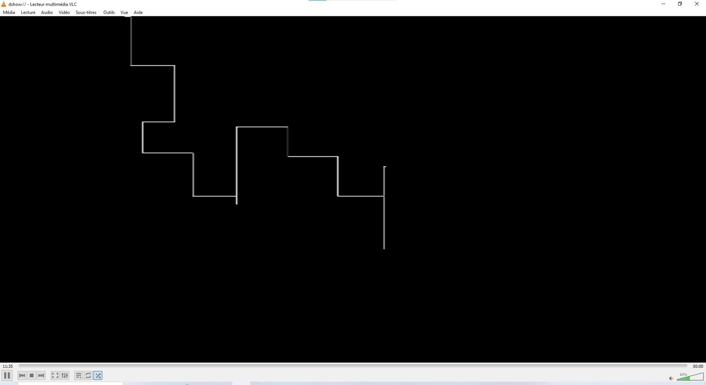

---

### Effacement de l’écran

L’effacement complet de l’écran est déclenché par un appui sur le **bouton poussoir de l’encodeur gauche**.

Un processus dédié :

- Parcourt l’ensemble des adresses de la mémoire  
- Écrit la valeur `'0'` dans chaque case  
- Réinitialise ainsi l’affichage en mettant tous les pixels à l’état noir  

---

## Conclusion

Ce projet a permis de mettre en œuvre un **système d’affichage vidéo complet sur FPGA**, intégrant :

- La gestion d’encodeurs rotatifs  
- La génération de signaux HDMI  
- L’utilisation d’une mémoire double port comme framebuffer  
- Des fonctionnalités avancées telles que la mémorisation du tracé et l’effacement de l’écran  

Le système final reproduit avec succès le comportement d’un **écran magique numérique entièrement fonctionnel**, piloté par des encodeurs matériels et affiché en temps réel sur un écran HDMI.

# Implémentation d’un Soft-Processeur Nios V

## 1. Introduction

Ce compte rendu présente les objectifs, la démarche et les résultats du **Travail Pratique consacré à l’implémentation et à l’exploitation d’un soft-processeur Nios V** sur une carte FPGA **Cyclone V**.  
Ce TP vise à approfondir la compréhension de l’intégration **hardware/software**, du développement de systèmes embarqués et de l’interfaçage avec des périphériques externes tels que les **LEDs** et l’**accéléromètre ADXL345**.

---

## 2. Partie 1 : Implémentation du Soft-Processeur Nios V

### 2.1. Architecture et outils utilisés

L’environnement de développement repose sur **Quartus Prime** pour la synthèse et la compilation matérielle, ainsi que sur **Platform Designer** pour la conception du système à base de soft-processeur.  
Le processeur **Nios V** est configuré avec une mémoire *on-chip*, un **JTAG UART** pour la communication et un contrôleur **PIO** permettant le pilotage des LEDs de la carte.

#### Mise en œuvre

1. **Organisation du projet**  
   Les fichiers sont structurés en plusieurs répertoires (`rtl`, `synt`, `sim`, `sopc`, `soft`) afin d’améliorer la lisibilité et la maintenance du projet.

2. **Création du projet Quartus**  
   Génération des fichiers `.qpf` et `.qsf` incluant les assignations globales et les contraintes spécifiques à la carte (horloge, reset, LEDs).

3. **Conception sous Platform Designer**
   - Instanciation du processeur **Nios V/m Microcontroller**
   - Ajout d’une mémoire **On-Chip Memory** de 128 KB
   - Intégration d’un **JTAG UART**
   - Ajout d’un **PIO (Parallel I/O)** de 10 bits pour le contrôle des LEDs
   - Configuration des interconnexions (horloge, reset, bus de données et d’instructions)
   - Attribution des adresses mémoire et configuration du vecteur de reset
   - Génération automatique du système en VHDL
 Architecture du système intégrant le processeur Nios V, la mémoire On-Chip, le JTAG UART et le contrôleur PIO.


Paramétrage de la mémoire interne du système.

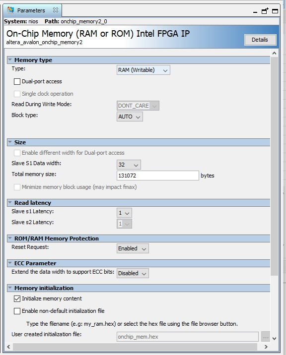]


Configuration du processeur Nios V/m incluant le vecteur de reset et les options de débogage.

]


4. **Intégration VHDL**  
   Le code HDL généré est intégré dans le fichier VHDL de niveau supérieur du projet Quartus afin d’instancier le soft-processeur sur le FPGA.

   Instanciation du système Nios V dans le fichier VHDL de niveau supérieur.
   
   ]
   

   Compilation matérielle du projet sans erreurs bloquantes.
   
   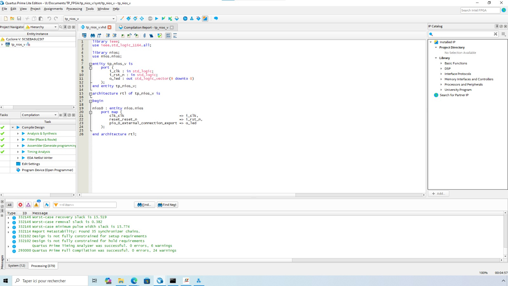]
   
   
   Chargement du bitstream sur la carte Cyclone V.
   
    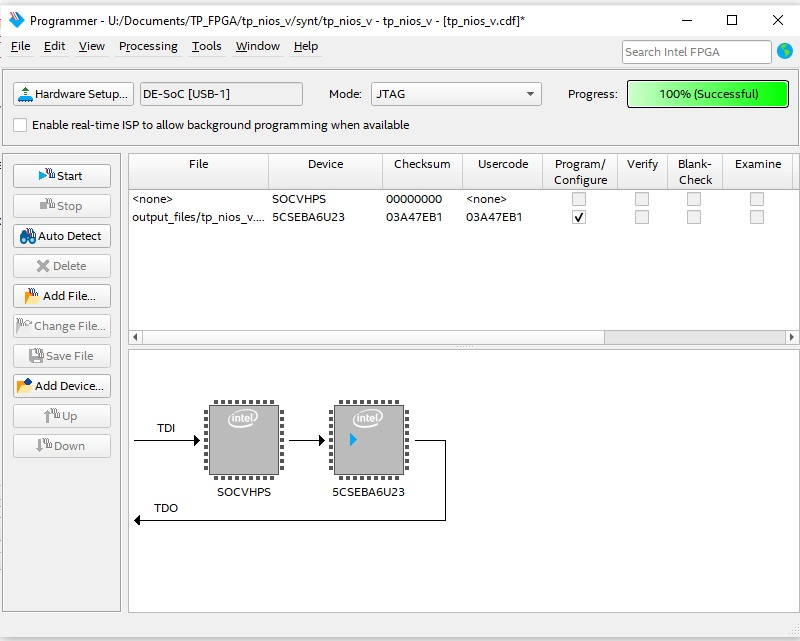]
   
---

### 2.2. Développement logiciel

Le développement logiciel est réalisé à l’aide de la chaîne d’outils **Nios V** et de l’IDE **RiscFree**.

#### Mise en œuvre

1. **Génération de la BSP**  
   Utilisation de l’outil `niosv-bsp` pour créer le *Board Support Package*, nécessaire à la communication entre le code C et le matériel.

2. **Création de l’application**  
   Génération de la structure de l’application C à l’aide de l’outil `niosv-app`.

3. **IDE RiscFree**  
   Importation de la BSP et de l’application afin d’éditer, compiler et déboguer le code.

---

### 2.3. Validation initiale

#### 2.3.1. Programme « Hello, world! »

**Objectif**  
Valider le bon fonctionnement du soft-processeur et de la communication via le **JTAG UART**.

**Implémentation**  
Un programme C simple affichant le message *« Hello, world! »* à l’aide de la fonction `printf`.

**Observations**  
Le message s’affiche correctement dans le terminal `juart-terminal` après la programmation et l’exécution du code.

Affichage du message Hello World dans le terminal JTAG UART.

 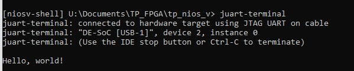]


---

#### 2.3.2. Chenillard lumineux

**Objectif**  
Tester le contrôle des GPIO et le pilotage des LEDs depuis le logiciel.

**Implémentation**  
Un programme C réalise un défilement lumineux sur les 10 LEDs à l’aide des macros d’accès au PIO (`IOWR_ALTERA_AVALON_PIO_DATA`) et de fonctions de temporisation (`usleep`).

**Observations**  
Une séquence lumineuse de type chenillard est visible sur les LEDs de la carte FPGA.

 Écriture dans le registre du périphérique PIO pour générer un défilement lumineux des LEDs.
 
  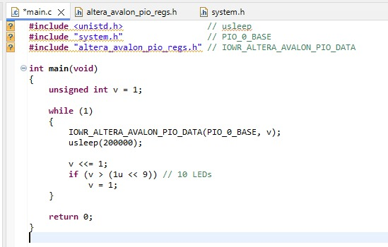]
 
---

## 3. Partie 2 : Projets embarqués avec accéléromètre

Cette partie explore l’intégration d’un capteur externe, l’**accéléromètre ADXL345**, afin de développer des applications interactives.

---

### 3.1. Niveau à bulles

**Objectif**  
Développer une application affichant l’inclinaison de la carte FPGA sur les LEDs, simulant un niveau à bulles numérique.

#### Mise en œuvre

1. **Extension du système SOPC**  
   Ajout d’un contrôleur **I2C (Avalon I2C Master)** dans Platform Designer.

2. **Mise à jour hardware/software**  
   Intégration du contrôleur I2C dans le VHDL de top-niveau, puis régénération et réimportation de la BSP et de l’application.

3. **Communication I2C**
   - Initialisation du bus I2C via la bibliothèque `altera_avalon_i2c.h`
   - Lecture du registre `DEVID` pour vérifier la présence de l’ADXL345
   - Activation du capteur via le registre `POWER_CTL`
   - Lecture des données d’accélération sur les axes X, Y et Z

4. **Application « Niveau à bulles »**  
   Les valeurs d’accélération sont interprétées afin de déterminer l’inclinaison de la carte et d’allumer les LEDs correspondantes.

    ]
 

---

